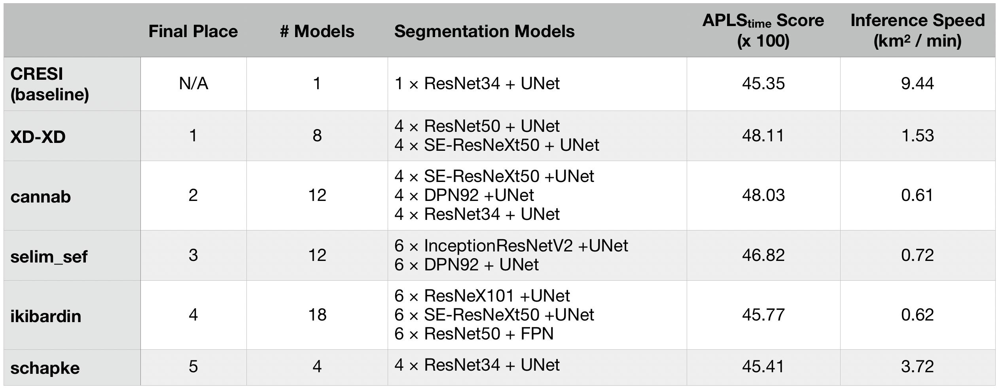
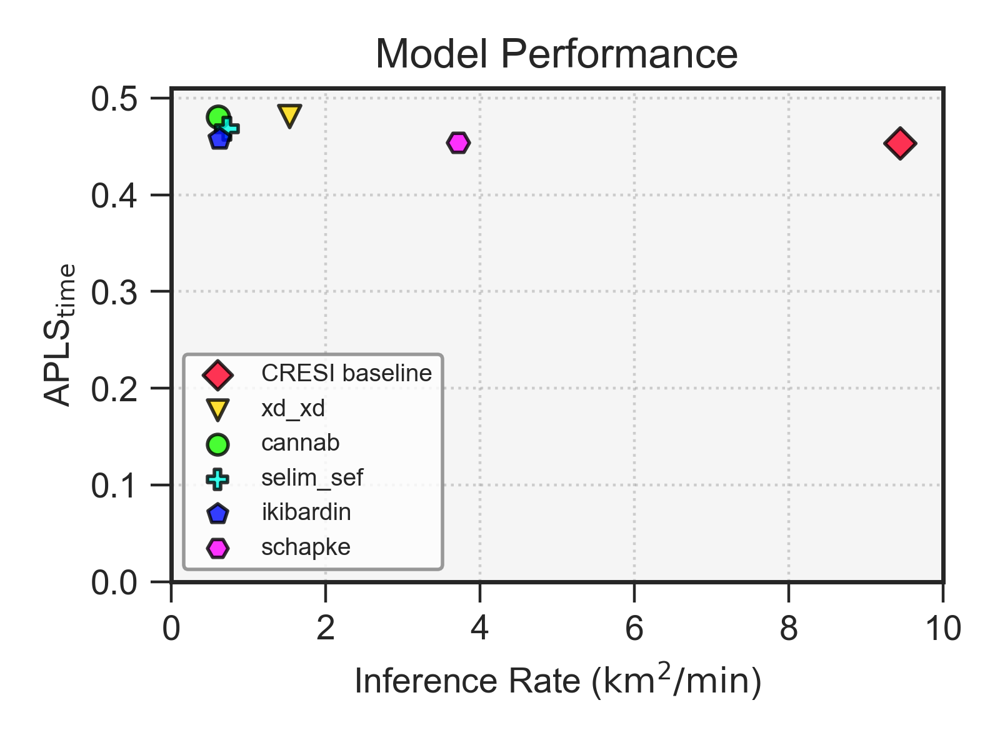

<p align="center">
<a href="https://spacenet.ai"></a>
</p>
<h1 align="center">SpaceNet Challenge Round 5: Road Networks and Optimized Routing</h1>
<h2 align="center">Competitor solutions</h2>
<br>

## Summary

The five subdirectories in this repository comprise the code for the winning solutions of SpaceNet 5: Road Networks and Optimized Routing hosted by TopCoder. Each subdirectory contains the competitors' written descriptions of their solution to the challenge. See the blog post on CosmiQ Works' blog [The DownlinQ](https://medium.com/p/fd02e00b826c) for an additional summary.  Baseline code can be found [here](https://github.com/CosmiQ/cresi).

Model weights are located in the SpaceNet s3 bucket:

```
aws s3 ls s3://spacenet-dataset/spacenet-model-weights/spacenet-5/
    PRE baseline/
    PRE cannab/
    PRE ikibardin/
    PRE schapke/
    PRE selim_sef/
    PRE xd_xd/
```

Performance of the algorithms on the SpaceNet 5 final test set is shown below (speed estimates are on a 4-GPU box):





---------

Questions about SpaceNet? Check out our website at [https://spacenet.ai](https://spacenet.ai).
